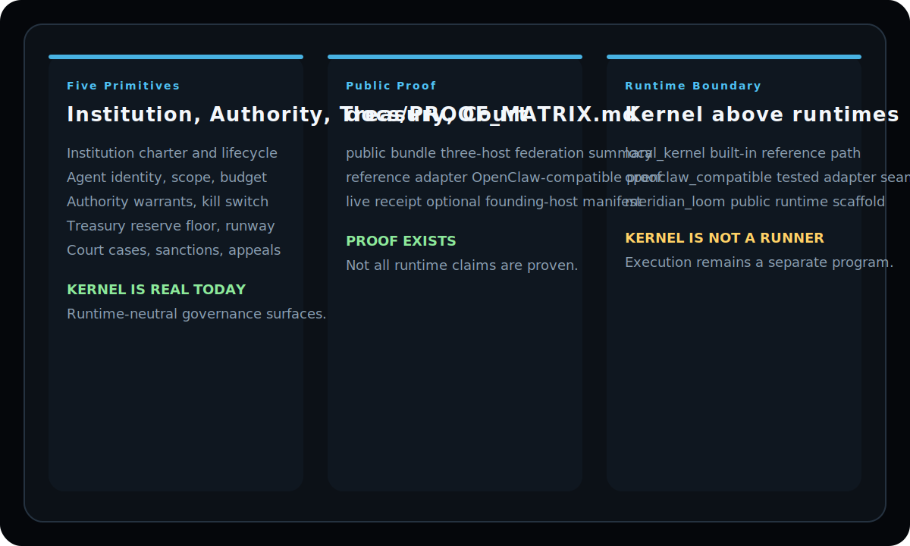

<p align="center">
  
</p>

<p align="center">
  
</p>

<p align="center">
  
  
  
  
  
</p>

<p align="center">
  <a href="docs/PROOF_MATRIX.md">Proof Matrix</a> ·
  <a href="docs/RUNTIME_CONTRACT.md">Runtime Contract</a> ·
  <a href="ARCHITECTURE.md">Architecture</a> ·
  <a href="https://github.com/mapleleaflatte03/meridian/tree/main/intelligence">Meridian Intelligence</a> ·
  <a href="https://github.com/mapleleaflatte03/meridian/tree/main/loom">Meridian Loom</a>
</p>

> Meridian Kernel is the governance boundary. It does not run your agents; it governs them with explicit authority, treasury, and court primitives.
>
> Canonical source moved to monorepo: https://github.com/mapleleaflatte03/meridian/tree/main/kernel  
> This repository remains as a mirror for compatibility.
>
> Mirror policy: [ARCHIVE_POLICY.md](ARCHIVE_POLICY.md)

# Meridian Constitutional Kernel

## 🛡️ The PoGE Protocol (Proof of Governed Execution)

Meridian enforces cryptographic audit trails for Wasm host-calls and settles governed execution evidence on EVM, so execution claims can be verified instead of trusted. The full technical draft RFC is available in the Meridian Loom docs at [`docs/MERIDIAN_PoGE_PROTOCOL.md`](https://github.com/mapleleaflatte03/meridian/blob/main/loom/docs/MERIDIAN_PoGE_PROTOCOL.md).

**Five kernel primitives for governing digital labor: Institution · Agent · Authority · Treasury · Court.**

The full Meridian platform composes a sixth platform primitive, **Commitment**, above this kernel boundary. This repo stays intentionally scoped to the five governance primitives so the kernel remains runtime-neutral and reusable.

Pure Python. No external dependencies. Apache-2.0.

## 5-Minute Golden Path

- Bootstrap: `python3 quickstart.py`
- Inspect Agents: open the workspace or query the local agent surfaces
- Issue Warrant: create a warrant proposal tied to a governed action
- Execute: run the action through a runtime that consumes the kernel contract
- Audit: inspect the emitted proof, treasury, and runtime audit trails

## Three-Part Architecture

Meridian is intentionally split into three layers so each part can evolve without blurring truth boundaries.

| Layer | Repo | Role |
|---|---|---|
| **Kernel** | This repo | Governance primitives, proof surfaces, capsule-backed state, and the runtime contract |
| **Intelligence** | [`meridian/intelligence`](https://github.com/mapleleaflatte03/meridian/tree/main/intelligence) | Governed work, planning, analysis, and operational intelligence on top of the kernel |
| **Loom** | [`meridian/loom`](https://github.com/mapleleaflatte03/meridian/tree/main/loom) | Meridian's official first-party runtime: a governed local agent runtime that consumes the kernel contract |

The kernel and intelligence layers can be exercised entirely locally. Meridian now uses a unified OSS workspace (`meridian/loom`, `meridian/kernel`, `meridian/intelligence`) for contributor onboarding, while preserving strict module boundaries. Loom remains a runtime surface that consumes this governance contract; Commitment lives at the Meridian platform layer above this repo and is not a sixth kernel primitive.

---

**Meridian does not run your agents. It governs them.**

Any runtime — Meridian Loom, MCP-backed apps, LangChain pipelines, A2A agents, or your own stack — can have its agents governed by the same five primitives. The governance layer is independent of the execution layer.

| Primitive | What It Does |
|-----------|-------------|
| **Institution** | Charter-governed container with lifecycle management and policy defaults |
| **Agent** | First-class identity with scopes, budget, risk state, and lifecycle |
| **Authority** | Approval queues, delegations, kill switch, sprint leadership |
| **Treasury** | Real money tracking: balance, runway, reserve floor, and budget enforcement |
| **Court** | Violations, sanctions, appeals, remediation — severity-based enforcement |

These compose over a three-ledger economy: **REP** (reputation/trust), **AUTH** (temporary authority), and **CASH** (real money). Agents earn reputation through accepted work, gain temporary authority from recent output, and spend real budget under treasury constraints.

---

## The Governance Gap

Runtimes are proliferating. MCP is a major open standard for tool connectivity. A2A is pushing agent-to-agent interoperability across vendors. Enterprise platforms are adding agent identity. Payment rails are adding agentic commerce.

In this world, the execution layer fragments — every team, vendor, and platform will have a runtime. What doesn't fragment is the need for governance: identity, authority, budget, accountability, and dispute resolution.

**Meridian is the governance layer above the runtime layer** — the same way Unix permissions work regardless of which shell or application you use.

If you run AI agents that spend money, make decisions, or produce work product, you need governance primitives. Not just prompts.

## Public Proof Today

The public proof is intentionally narrower than the full thesis.

What is real today:
- the five kernel primitives
- the reference workspace and JSON API
- the `runtime_core` surface that exposes institution context, host identity, boundary identity model, service registry, admission state, and federation gateway state
- one real built-in reference runtime path: `local_kernel`
- one tested kernel-side legacy compatibility bridge: `legacy_v1_compatible`
- agent records now carry an explicit `runtime_binding` field, and the surfaced workspace APIs keep that binding coherent with the runtime registry
- one tested host-service federation primitive: signed HMAC envelopes with peer registry and replay protection
- one institution-scoped federation inbox surface on the receiver side: accepted envelopes persist into the target capsule and are surfaced through `GET /api/federation/inbox`
- one witness archival fan-out path: successful federated deliveries can automatically archive envelope/payload/receipt snapshots on configured witness-host peers and surface the archival results in the sender response
- one receiver-side settlement application path: accepted `settlement_notice` envelopes can record a settlement ref, settle the linked commitment, and move the inbox entry from `received` to `processed`
- one receiver-side execution review path: accepted `execution_request` envelopes can materialize a local federated execution job plus a pending local warrant instead of implying remote work is already authorized
- one sender-side review feedback path: receiver-side warrant review for a federated `execution_request` can emit a signed `court_notice` back to the source host, so sender-side warrant state and commitment provenance reflect remote review before settlement
- one routing-planner preview path: `/api/status` and `/api/federation` now surface local/remote/blocked routing decisions, and remote candidates can be persisted into `GET /api/federation/handoff-preview-queue` for inspection without claiming remote execution
- one tested legacy-compatible federation seam in OSS: the kernel-side `legacy_v1_compatible` adapter can wrap a federated `execution_request` story in tests by gating the action envelope before dispatch and emitting metering/audit proof after the federated receipt returns, without claiming a live legacy runtime deployment is already wired
- one sender-side commitment outbox seam that Loom can now consume locally: successful `execution_request` deliveries can append sender-side `delivery_refs` with `payload_hash` and `adapter_envelope` to the linked commitment, making the kernel's own commitment truth rich enough for Loom to import into a local runtime queue
- one first-class commitment primitive: capsule-backed commitment records, workspace commitment APIs, sender-side federation validation when `commitment_id` is supplied, and warrant-bound `commitment_proposal` / `commitment_acceptance` / `commitment_breach_notice` envelopes
- one first-class payout primitive: capsule-backed payout proposals, workspace payout APIs, and warrant-bound reference execution against the institution ledger
- one settlement readiness snapshot: `GET /api/treasury/settlement-adapters/readiness` reports host support and execution blockers truthfully, instead of implying external settlement is live
- one payout dry-run preview path: `/api/payouts/execute?dry_run=true` can preview a payout execution, `GET /api/treasury/payout-plan-preview-queue` and `/inspect` expose the preview queue, and operator acknowledgment is recorded without claiming settlement
- two institution-owned service surfaces: capsule-backed `subscriptions` and `accounting`, both exposed through the reference workspace as institution-bound session surfaces
- one integrated 3-host federation proof in tests: proposal, acceptance, execution review, court notice, breach notice, and witness archival now compose into one end-to-end kernel story

What is not yet broadly proven:
- live end-to-end deployment wiring for MCP- or A2A-style integrations
- live multi-host federation between independent Meridian deployments
- live multi-institution routing inside one deployed service boundary

The new routing and settlement preview surfaces are intentionally narrower than live execution. They show planner truth, dry-run state, and operator acknowledgments; they do not claim remote work or non-`internal_ledger` settlement is live.

The executable proof map now lives in [docs/PROOF_MATRIX.md](docs/PROOF_MATRIX.md).
For the smallest high-signal rerun, generate the public proof bundle with
[`examples/generate_public_proof_bundle.py`](examples/generate_public_proof_bundle.py).
For a terminal-friendly summary instead of raw JSON, add `--format human`.
That bundle now emits:
- a structured three-host federation summary
- a structured legacy reference-adapter federation summary
- an optional live host receipt when `--live-manifest-url` is supplied
- a local Loom runtime receipt when `kernel/runtime_audit/loom_runtime_events.jsonl`
  exists, including canonical runtime IDs and budget reservation status
- an explicit `not_live_proven` list

The kernel audit CLI also has two proof-first local runtime inspection surfaces:

```bash
python3 kernel/audit.py tail-runtime --limit 10
python3 kernel/audit.py summarize-runtime --limit 20
```

Those commands summarize Loom runtime audit events from the kernel-owned local
runtime audit file without pretending the hosted audit trail is already owned by
Loom.

See [`examples/public-proof-bundle-human.txt`](examples/public-proof-bundle-human.txt) for a checked-in human-format example captured in a restricted environment.

For the broader frontier agenda behind Loom as Meridian's first-party runtime roadmap, see
[`docs/LOOM_100_IMPROVEMENTS.md`](https://github.com/mapleleaflatte03/meridian-loom/blob/main/docs/LOOM_100_IMPROVEMENTS.md).
That document is intentionally a research docket for future Loom expansion, not a present-tense product claim about every runtime feature already shipping today.

The example intelligence workload proves governed work on top of the kernel. It is a good wedge, not the whole definition of Meridian.

## What Is Open

Everything in this repo: the five kernel primitives, the economy layer they compose over, the governed workspace demo, and a complete example vertical. Apache-2.0 licensed.

## What Is Not Open

The hosted Meridian service — delivery pipelines, payment processing, customer data, proprietary research sources. See [OPEN_SOURCE_BOUNDARY.md](OPEN_SOURCE_BOUNDARY.md) for the full list.

You don't need the hosted service. This kernel runs standalone.

---

## Who This Is For

**Use Meridian if you:**
- Run AI agents that spend money, call APIs, or produce work product
- Need governance beyond "trust the prompt" but don't want to build it from scratch
- Want agents to have identity, budgets, authority, and accountability
- Need a kill switch, approval queues, or sanction enforcement
- Want to separate governance from your agent runtime — and keep that separation as runtimes evolve (MCP, A2A, custom)
- Want a governance layer that is runtime-neutral and can extend to new runtimes over time

**This is not for you if you** need a chatbot framework, an agent runner, or a mature ecosystem with hundreds of integrations. Meridian is the governance layer — it doesn't run your agents, it governs them.

---

## Quickstart

**Requirements:** Python 3.9+, no external dependencies.

```bash
curl -fsSL https://raw.githubusercontent.com/mapleleaflatte03/meridian/main/scripts/install-full.sh | bash
```

Runtime-only mirror path (this repo only):

```bash
git clone https://github.com/mapleleaflatte03/meridian-kernel.git
cd meridian-kernel
python3 quickstart.py
```

This will:
1. Reconcile the repo's local demo institution, charter, and policies
2. Register seven example agents with roles, budgets, and scopes
3. Reconcile the demo economy state (reputation, authority, treasury)
4. Start the governed workspace at `http://localhost:18901`

Open the dashboard to see all five primitives live:
- View agent reputation and authority scores
- Engage/disengage the kill switch
- File and resolve court violations
- Check treasury runway and budget gates
- Run the example intelligence vertical preflight

This quickstart boots a **local demo institution** and the **reference workspace**.
For a real deployment, treat the JSON API and the [Constitutional Runtime Contract](docs/RUNTIME_CONTRACT.md)
as the integration boundary and build your own runtime adapter or control plane on top.

You can also bind the reference workspace to one institution explicitly:

```bash
python3 kernel/workspace.py --org-id org_b7d95bae
```

`/api/context` reports the bound institution, and request-level `org_id` or
`X-Meridian-Org-Id` hints are only accepted when they exactly match that bound
context. It also reports the workspace auth scope; `MERIDIAN_WORKSPACE_AUTH_ORG_ID`
or an `org_id:` line in the credentials file can pin HTTP Basic auth to the same
institution. Add `MERIDIAN_WORKSPACE_USER_ID=<user_id>` or `user_id:` in the
credentials file if you want mutation audit and role checks to bind to a real
institution member instead of a generic Basic-auth username. `/api/context`
also exposes the effective mutation permission snapshot for that bound actor.
`/api/context` and `/api/status` now also expose `runtime_core`, which surfaces
the bound institution context, the current host identity, the current boundary
identity model, the known boundary registry, and the admission state for the
current process. This remains a process-bound reference surface, not general
multi-org routing. The current admission model is `single_process_per_institution`:
admit institutions at the host level, then bind a different institution with
another process instead of hopping orgs inside one process.
`/api/admission` now exposes that host-level admission state directly, and the
reference workspace can mutate the file-backed admission registry via
`POST /api/admission/admit`, `/api/admission/suspend`, and
`/api/admission/revoke` when the bound actor has owner authority.
The same `runtime_core` surface now also exposes the `federation_gateway`
boundary state: whether the host has federation enabled, which peer hosts are
trusted, and whether replay protection is file-backed or memory-only.
`/api/agents` surfaces each agent record's `runtime_binding`, `/api/status`
includes the same field in the workspace snapshot, and `/api/runtimes`
surfaces the runtime registry truth used to interpret those bindings.
`GET /api/federation/inbox` now exposes the receiver-side capsule-backed inbox
for accepted federation messages, including per-message-type counts and the
latest accepted entries for the bound institution.
`GET /api/federation/execution-jobs` now exposes the receiver-side queue of
incoming `execution_request` envelopes that have been converted into local
review objects. The receiver issues a local `federated_execution` warrant in
`pending_review` state for that job instead of trusting the sender's warrant
as sufficient local authorization.
Receiver-side warrant review now also drives that queue honestly: approving the
local warrant moves the execution job to `ready`, while staying or revoking it
moves the job to `blocked` or `rejected`.
That same receiver-side review loop now has one real control-plane feedback
object: reviewing the receiver's local warrant for an incoming
`execution_request` can send a signed `court_notice` back to the source host,
so the sender can sync its own execution warrant state and append the review
notice to the linked commitment without pretending settlement already happened.
`POST /api/federation/execution-jobs/execute` now closes that receiver-side
loop for the reference path: a `ready` job can be marked locally executed,
its local warrant is marked `executed`, and the receiver reuses an already
persisted linked payout execution or settlement ref to emit one idempotent
`settlement_notice` back to the source host when the job is linked to a
commitment. Caller-supplied `execution_refs` are not accepted on this route.
When the received message is a valid `settlement_notice` with a settlement-ready
`commitment_id`, the receiver can now apply that notice directly to the local
commitment record and mark the inbox entry as `processed`; if an active case
blocks settlement, the transport still succeeds but the inbox entry remains
`received`. Before any notice is applied, the receiver now replays the local
settlement-adapter preflight contract against the incoming proof; invalid
notices open `invalid_settlement_notice` cases and can automatically suspend
the peer on the reference path.
That same boundary registry now declares whether a boundary requires warrants
and which message types map to which warrant action classes.
`/api/warrants` now exposes first-class warrant records and summary counts, and
the reference workspace can mutate those records through
`POST /api/warrants/issue`, `/api/warrants/approve`, `/api/warrants/stay`, and
`/api/warrants/revoke` when the bound actor has admin authority.
Federated `execution_request` delivery is now gated by an executable warrant on
the sender side, and accepted receiver audit entries preserve `warrant_id`
provenance. This is the first court-first execution gate, not the full
cross-host constitutional autonomy program.
`/api/commitments` now exposes first-class commitment records and summary
counts, and the reference workspace can mutate those records through
`POST /api/commitments/propose`, `/api/commitments/accept`,
`/api/commitments/reject`, `/api/commitments/breach`, and
`/api/commitments/settle` when the bound actor has admin authority.
Federation delivery can now validate an accepted `commitment_id` on the sender
side and append delivery references to the capsule-backed commitment record.
The same commitment surface now also supports a first real federated
commitment loop: `POST /api/commitments/propose`, `POST /api/commitments/accept`,
and `POST /api/commitments/breach` can dispatch warrant-bound
`commitment_proposal` / `commitment_acceptance` / `commitment_breach_notice`
envelopes, so the receiver can persist a mirrored commitment record, the
source host can move the original record to `accepted` from a signed peer
acceptance, and the source host can auto-open a linked breach case from a
signed peer breach notice rather than a same-host shortcut.
`/api/cases` now exposes first inter-institution case records and summary
counts, and the reference workspace can mutate those records through
`POST /api/cases/open`, `/api/cases/stay`, and `/api/cases/resolve`.
Commitment breach can now open a linked local case record and freeze the
breaching peer on the receiver side, but this is still the start of the
cross-institution court program rather than the full network dispute system.
Those case endpoints can also federate a `case_notice` protocol object: the
sender can mirror open/stay/resolve to the target host, and the receiver
applies that notice idempotently against the source host/institution/source
case key while keeping federation fail-closed.
`POST /api/treasury/settlement-adapters/preflight` now exposes the same
settlement-adapter contract as a preflight surface: it tells the caller
whether an adapter is merely registered, whether payout execution is enabled on
that adapter, whether the current host supports it, and whether the supplied
currency / tx hash / proof shape is acceptable before execution is attempted.
Open or stayed cases now also have real enforcement effect: a linked
`commitment_id` blocks sender-side federation delivery, and risky case types
such as `fraudulent_proof`, `invalid_settlement_notice`, or
`misrouted_execution` automatically suspend the trusted peer on the OSS
reference path.
The same case state now also blocks `POST /api/commitments/settle`; if the case
links an execution warrant, that warrant is stayed before settlement can retry.
Bad federation receipts or forged delivery proofs can now auto-open those case
records on the sender path, and a linked execution warrant is automatically
stayed before another cross-host attempt can proceed. Contradiction handling is
no longer just an audit log.
`/api/payouts` now exposes a real payout proposal lifecycle through
`POST /api/payouts/propose`, `/api/payouts/submit`, `/api/payouts/review`,
`/api/payouts/approve`, `/api/payouts/open-dispute-window`,
`/api/payouts/reject`, `/api/payouts/cancel`, and
`/api/payouts/execute`.
Execution is intentionally narrow. It requires an executable
`payout_execution` warrant, a payout-eligible wallet, surplus above reserve,
and a phase-5 contributor-payout gate before the reference workspace will
write a payout execution row to the institution ledger. This is a real kernel
primitive, not yet the full settlement-adapter ecosystem.
`GET /api/treasury/settlement-adapters` now surfaces the institution payout
adapter registry. On the current reference path only `internal_ledger` is
execution-enabled; `base_usdc_x402` remains registered but policy-disabled
until a stronger external settlement proof path exists. `manual_bank_wire` is
now executable on the internal/manual reference path when host support and
manual-wire verifier evidence are present; the wire itself remains manual/offchain.
Even when an external adapter is policy-enabled in a reference test, execution
still stays fail-closed until the adapter contract marks its verifier ready and
the proof carries an accepted verifier attestation.
`GET /api/subscriptions`, `GET /api/subscriptions/delivery-targets`, and
`GET /api/accounting` now surface institution-owned service state directly from
the bound capsule. The OSS workspace also exposes mutation paths for those
services, but that proof is still process-bound to one institution per
workspace process, not general request-level multi-org routing.

Need the exact handoff from demo to real deployment?
See [Deployment Guide](docs/DEPLOYMENT_GUIDE.md).

### Try the primitives directly

```bash
# Run the example vertical preflight
python3 examples/intelligence/ci_vertical.py preflight

# File a test violation
python3 kernel/court.py file \
  --agent atlas --org meridian \
  --type weak_output --severity 2 \
  --evidence "Test violation for demo"

# Check the court record
python3 kernel/court.py show

# Check treasury budget gate
python3 kernel/treasury.py check-budget --agent_id atlas --cost 0.50

# Engage the kill switch
python3 kernel/authority.py kill-switch on --by owner --reason "Testing"
python3 kernel/authority.py show
python3 kernel/authority.py kill-switch off --by owner
```

---

## Architecture

```
┌───────────────────────────────────────────────────────┐
│  Governed Workspace (workspace.py)                    │
│  Owner-facing dashboard + JSON API                    │
├───────────────────────────────────────────────────────┤
│  Kernel Primitives                                    │
│  ┌───────────┐ ┌───────┐ ┌───────────┐ ┌──────────┐ │
│  │Institution│ │ Agent │ │ Authority │ │ Treasury │ │
│  └───────────┘ └───────┘ └───────────┘ └──────────┘ │
│  ┌─────────┐ ┌────────────────────────────────────┐  │
│  │  Court  │ │ Runtime Adapter (runtime_adapter.py)│  │
│  └─────────┘ └────────────────────────────────────┘  │
├───────────────────────────────────────────────────────┤
│  Economy Layer                                        │
│  REP (reputation) + AUTH (authority)                  │
│  + CASH (treasury) + Sanctions + Scoring              │
├───────────────────────────────────────────────────────┤
│  Runtime Adapter Layer (runtime-neutral)              │
│  ┌─────────────┐ ┌──────────────┐ ┌───────────────┐  │
│  │ local_kernel│ │  loom_native │ │  mcp_generic  │  │
│  │  (built-in) │ │   (active)   │ │   (planned)   │  │
│  └─────────────┘ └──────────────┘ └───────────────┘  │
│  ┌─────────────┐ ┌──────────────┐                    │
│  │ a2a_generic │ │ your runtime │                    │
│  │  (planned)  │ │  (register)  │                    │
│  └─────────────┘ └──────────────┘                    │
└───────────────────────────────────────────────────────┘
```

The kernel doesn't run your agents. It governs them. Any runtime that satisfies the [Constitutional Runtime Contract](docs/RUNTIME_CONTRACT.md) can, in principle, be governed by the same five primitives once a real adapter exists.

## Runtime Adapters

Meridian is runtime-neutral in design. Today, one runtime path is built in and one external family has a tested kernel-side reference adapter; the others remain declared targets:

| Runtime | Protocol | Contract Status |
|---------|----------|----------------|
| `local_kernel` | custom | Compliant (7/7) — built-in reference |
| `loom_native` | custom, MCP, A2A | Active (7/7) — primary Meridian runtime with 11 live runtime planes, governed capability dispatch, session provenance, and PoGE receipts |
| `legacy_v1_compatible` | custom | Active (adapter bridge) — bounded compatibility seam for legacy integration paths |
| `mcp_generic` | MCP | Planned (2/7) — no adapter yet |
| `a2a_generic` | A2A | Planned (1/7) — no adapter yet |
| `openfang_compatible` | custom | Planned (0/7) — no adapter yet |

```bash
# Check declared contract compliance for all runtimes
python3 kernel/runtime_adapter.py check-all

# Inspect kernel-side proof for a specific adapter
python3 kernel/runtime_adapter.py check-proof --runtime_id legacy_v1_compatible

# Register your own runtime
python3 kernel/runtime_adapter.py register \
  --id my_runtime --label "My Runtime" \
  --type hosted --protocols "MCP,custom" --identity_mode api_key
```

The [Constitutional Runtime Contract](docs/RUNTIME_CONTRACT.md) defines the seven integration hooks and includes a minimal integration example. `check-all` reports registry metadata plus any tested kernel-side reference adapter hooks; it still does not certify a live deployment unless the runtime actually routes events through that adapter.

## Composition Pattern

Kernel primitives compose over the economy layer — they import and extend, never rewrite:

| Economy Module | Kernel Primitive | What's Composed |
|---------------|-----------------|-----------------|
| `economy/authority.py` | `kernel/authority.py` | Sprint leadership, action rights, block matrix |
| `economy/sanctions.py` | `kernel/court.py` | Sanction application, lifting, restriction checks |
| `economy/score.py` | `kernel/agent_registry.py` | REP/AUTH scoring synced to agent risk state |
| `economy/revenue.py` | `kernel/treasury.py` | Balance, runway, budget enforcement, external settlement evidence |

## State Files

All state is JSON/JSONL on the local filesystem. No database required.

| File | Contents | Scope |
|------|----------|-------|
| `kernel/organizations.json` | Institutions with charters and policies | Global |
| `kernel/agent_registry.json` | Agents with scores, budgets, risk states, and `runtime_binding` | Global |
| `economy/capsules/<org_id>/ledger.json` | Economy state (REP, AUTH, CASH per agent) | Per-institution (capsule) |
| `economy/capsules/<org_id>/revenue.json` | Revenue orders, clients, receivables | Per-institution (capsule) |
| `economy/capsules/<org_id>/transactions.jsonl` | Transaction log | Per-institution (capsule) |
| `economy/authority_queue.json` | Pending approvals, delegations, kill switch | Per-institution (capsule) |
| `economy/court_records.json` | Violations, sanctions, appeals | Per-institution (capsule) |
| `kernel/audit_log.jsonl` | Append-only audit trail | Global (org-tagged) |
| `kernel/metering.jsonl` | Usage metering events | Global (org-tagged) |

---

## Example Vertical: Competitive Intelligence

The `examples/intelligence/` directory shows a complete agent workflow mapped onto the five primitives:

```
Research (Atlas) → Write (Quill) → QA (Sentinel) → Accept (Aegis)
    → Execute (Forge) → Compress (Pulse) → Deliver → Score
```

Each phase checks authority, respects budget gates, and records court violations on failure. The preflight command checks all constitutional gates before the pipeline runs.

This is an example workload, not the definition of Meridian. You can build any governed workflow on the same kernel.

### Governance Simulation

See governance enforcement in action without starting a server:

```bash
python3 examples/simulate_governance.py
```

Runs 10 governed actions including 2 deliberate failures. You will see:
- A **budget gate** block an action that would breach the treasury reserve floor
- A **court violation** filed for rejected output, with a PROBATION sanction applied
- An **authority check** block a sanctioned agent from leading work
- **REP and AUTH rewards** for accepted output
- Every action audited with agent identity and cost attribution

This uses temporary state and cleans up after itself.

---

## Rust Exploration Lane

Kernel remains Python-first in production. The Rust exploration lane is additive
and exists for scale-parity validation only.

Run it with:

```bash
./examples/run_rust_kernel_exploration.sh
```

This executes deterministic governance tests in `kernel-rs-explore/` covering:
- warrant/authority/court gate ordering
- treasury reserve-floor denial behavior
- proof envelope emission for every decision

---

## Contributing

See [CONTRIBUTING.md](CONTRIBUTING.md). No CLA required — Apache-2.0 inbound = outbound.

Good places to start:
- Issues labeled `good first issue`
- Issues labeled `help wanted`
- Adding a new example vertical
- Improving the governed workspace UI
- Writing tests for kernel primitives

## Security

Report vulnerabilities privately per [SECURITY.md](SECURITY.md). Do not open public issues for security bugs.

## Sponsorship

If Meridian is useful to your work, consider [sponsoring the project](https://github.com/sponsors/mapleleaflatte03). GitHub Sponsors is the primary funding path.

Sponsors help fund kernel development, security audits, documentation, and community infrastructure.

For crypto sponsorship (USDC on Base), see the wallet registry in [`treasury/wallets.json`](treasury/wallets.json). All contributions are governed by the [Contributor Treasury Protocol](docs/treasury/CONTRIBUTOR_TREASURY_PROTOCOL.md).

## License

Apache-2.0. See [LICENSE](LICENSE).

---

[Architecture](ARCHITECTURE.md) · [Deployment Guide](docs/DEPLOYMENT_GUIDE.md) · [Scale Tranche](docs/SCALE_TRANCHE.md) · [Open-Source Boundary](OPEN_SOURCE_BOUNDARY.md) · [Economy Constitution](economy/ECONOMY_CONSTITUTION.md) · [Roadmap](ROADMAP.md) · [Governance](GOVERNANCE.md)
