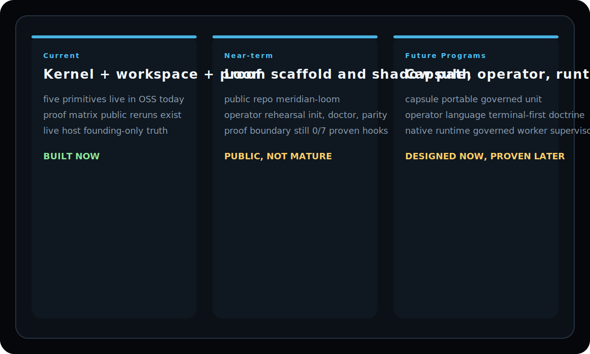

  

  Ordered programs for the kernel, public proof, Loom scaffold, and future capsule/operator work.

  
  
  
  

  <a href="README.md">README</a> ·
  <a href="ARCHITECTURE.md">Architecture</a> ·
  <a href="docs/LOOM_SPEC.md">Loom Spec</a> ·
  <a href="docs/CAPSULE_SPEC.md">Capsule Spec</a> ·
  <a href="https://github.com/mapleleaflatte03/meridian-loom">Loom Repo</a>

  

> The roadmap is split on purpose: current proof, near-term Loom rehearsal, and future runtime/capsule/operator programs should never be collapsed into one false “done” story.

# Roadmap

## v0.1 — Core Kernel (Current)

The five constitutional primitives, economy layer, governed workspace
demo, and example vertical.

- [x] Institution primitive (charter, lifecycle, policy defaults)
- [x] Agent primitive (identity, scopes, budget, risk state, lifecycle)
- [x] Authority primitive (approvals, delegations, kill switch)
- [x] Treasury primitive (balance, runway, reserve floor, budget enforcement)
- [x] Court primitive (violations, sanctions, appeals, remediation)
- [x] Three-ledger economy (REP, AUTH, CASH)
- [x] Governed workspace (HTML dashboard + JSON API)
- [x] Example vertical (competitive intelligence pipeline)
- [x] Quickstart script (under 10 minutes)

## v0.1.2 — Runtime-Neutral Constitutional Layer

- [x] Runtime-neutral architecture thesis applied to README and ARCHITECTURE
- [x] Runtime adapter primitive (`kernel/runtime_adapter.py`)
- [x] Runtime registry (`kernel/runtimes.json`) with five seeds:
      local_kernel (compliant), openclaw_compatible (partial),
      mcp_generic (non-compliant 2/7), a2a_generic (non-compliant 1/7), openfang_compatible (planned)
- [x] Constitutional runtime contract (`docs/RUNTIME_CONTRACT.md`) — seven requirements
- [x] Contract compliance checker (`check_contract`, `check-all` CLI)
- [x] Workspace API `/api/runtimes` endpoint
- [x] Settlement adapter readiness snapshot (`/api/treasury/settlement-adapters/readiness`)
- [x] Routing planner and handoff preview queue (`/api/status`, `/api/federation/handoff-preview-queue`)
- [x] Payout dry-run preview queue (`/api/treasury/payout-plan-preview-queue`, `/inspect`, operator ack)
- [ ] MCP adapter implementation (agent identity, action envelope, sanction controls)
- [ ] A2A adapter implementation (action envelope mapping from A2A task schema)
- [ ] OpenClaw adapter (cost attribution + budget gate hooks)
- [x] Runtime binding field in agent_registry.json (link agent to runtime)

## v0.1.1 — Contributor Treasury Protocol

- [x] Wallet registry with verification levels (0-4)
- [x] Treasury account separation (company, maintainer, contributor)
- [x] Maintainer and contributor registries
- [x] Payout proposal state machine (6 states, 72h dispute window)
- [x] Funding source classification (6 types)
- [x] Protocol documentation (treasury policy, payout policy, wallet verification, fraud policy)
- [x] Treasury CLI extensions (wallets, accounts, maintainers, contributors, proposals, funding-sources)
- [x] Workspace API extensions (6 GET endpoints)
- [ ] SIWE wallet verification (Level 3)
- [ ] Safe multisig deployment (Level 4)
- [ ] Authority-gated payout approvals (wire into approval queue)

## v0.2 — Vertical Plugin System

Make it easy to define custom verticals without modifying kernel code.

- [ ] Vertical definition format (YAML/JSON)
- [ ] Phase-to-agent mapping configuration
- [ ] Custom violation types per vertical
- [ ] Vertical-specific dashboard panels
- [ ] Second example vertical (e.g., code review pipeline)

## v0.3 — Multi-Institution

Support multiple institutions in a single deployment.

- [ ] Cross-institution agent sharing
- [ ] Institution-scoped policies and budgets
- [ ] Inter-institution authority delegation
- [ ] Federated audit trails

## v0.4 — Persistent Storage Backends

Move beyond JSON files for production deployments.

- [ ] SQLite backend
- [ ] PostgreSQL backend
- [ ] Storage backend abstraction layer
- [ ] Migration tooling from JSON to database
- [ ] Concurrent access safety

## v0.5 — API Stability

Prepare for 1.0 by stabilizing the public API.

- [ ] Versioned JSON API
- [ ] Backward compatibility policy
- [ ] API documentation generation
- [ ] Client library (Python)

## v1.0 — Production Ready

Stable API, production storage, comprehensive tests, security audit.

- [ ] Full test coverage for all primitives
- [ ] Security audit
- [ ] Performance benchmarks
- [ ] Production deployment guide
- [ ] OpenSSF Best Practices badge

## Meridian Loom — Native Runtime (Planned)

Meridian Loom is a planned Meridian-native execution runtime designed to
implement all 7 contract hooks natively without adapter translation. A public
experimental scaffold now exists at
`https://github.com/mapleleaflatte03/meridian-loom`, but no governed runtime
exists yet. See [LOOM_SPEC.md](docs/LOOM_SPEC.md).

| Phase | Goal | Contract Hooks | Gate |
|-------|------|---------------|------|
| 0 (current) | Spec + public scaffold + 7-surface rehearsal + fail-closed `loom action execute` + governed local worker dispatch on allow-path + queue-backed `action enqueue` / `supervisor run` rehearsal + runtime-owned `job list` / `job inspect` surfaces + bounded `supervisor watch` loop with heartbeat/status artifacts + local daemon lifecycle rehearsal + local runtime service with socket-first ingress and truthful file-backed fallback + commitment-backed sender-side `execution_request` import + kernel-owned runtime audit artifacts + parity stream with per-action OpenClaw probe artifacts | 0/7 | — |
| 1 | Shadow mode alongside primary runtime | 2/7 | Zero governance divergence over 3+ runs |
| 2 | Governed worker cells | 5+/7 | Single agent completes end-to-end in Loom |
| 3 | Capability ABI | 7/7 maintained | Custom capability loads at runtime |
| 4 | Checkpoint/sanction native layer | 7/7 | Sanctioned agent blocked natively |
| 5 | Native ingress (OpenClaw replacement) | 7/7 | 7 consecutive clean runs + owner approval |

Architecture: Rust supervisor, Python/TypeScript workers, WASM capability
modules. Separate repository (`meridian-loom`). Loom depends on the kernel
contract; the kernel never depends on Loom. See [docs/loom/](docs/loom/)
for packaging, CLI, modes, and repository strategy.

Shadow mode prerequisites (checklist): [docs/loom/SHADOW_PREREQUISITES.md](docs/loom/SHADOW_PREREQUISITES.md)

## Capsule Formalization

The capsule isolation primitive (`kernel/capsule.py`) is proven and tested.
The next architectural lane is formalizing capsules as portable governed work
units — signed, transmittable bundles with integrity manifests and provenance.

See [docs/CAPSULE_SPEC.md](docs/CAPSULE_SPEC.md) for current state vs. design
thesis, phased implementation, and integrity verification design.

## Operator Language

Terminal-first operator grammar shared across all command surfaces. Defines
command voice, status vocabulary, severity levels, and proof surface commands.

See [docs/OPERATOR_LANGUAGE.md](docs/OPERATOR_LANGUAGE.md).

## Future

Ideas under consideration (not committed):

- **SDK** — Python SDK for building governed agent systems
- **Hosted service** — Managed Meridian for teams that don't want to self-host
- **Enterprise features** — SSO, RBAC, compliance reporting
- **Runtime integrations** — Adapters for LangChain, CrewAI, AutoGen, etc.
- **Programmable payment rails** — Stablecoin treasury integration

## Contributing to the Roadmap

Roadmap priorities are influenced by community feedback. If a planned
feature matters to you, open an issue or upvote an existing one.

If you want to work on a roadmap item, comment on the relevant issue
or open a new one to coordinate.
